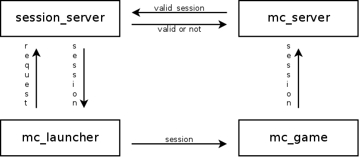

# Account
关联DZ论坛的登录插件。请先建好论坛用户中心表再使用本插件，否则可能出现未知问题。如果使用中报错请修改表格式不要有非空栏位。

## Require
- Java 8
- SimpleORM
    - 前置插件。
    - https://github.com/caoli5288/SimpleORM/releases

## Command
下面列出的是该插件支持的指令。
- /login <密码>
- /l
- /register <密码> <密码>
    - 注册，需要重复两次密码。
    - 数据写入`pre_ucenter_members`表。
- /reg
- /r

## Extra
插件启动后新建表`app_account_event`用以记录玩家登陆事件。

### Table Structure
Column | Type     | Description
-------|----------|--------------
id     | int      | Primary Key
name   | varchar  | Player's name
ip     | varchar  | Player's ip
type   | int      | Event Type
time   | datetime | Event Time

### Event Type
Id | Description
---|-----------------
0  | Register Succeed
1  | Register Failed
2  | Login Succeed
3  | Login Failed

## Bungee Session
支持蹦极服务器的会话保存。只要蹦极会话不断开就不必重复输入密码。

## Session
支持以会话的形式管理用户登陆。会话应该在玩家登陆之前请求服务器取得，
在玩家登陆之后以PluginChannel形式交服务器校验。(Unstable API)

## License
本插件源代码及其二进制文件以GPLv2发布，请使用者遵守该协议。
